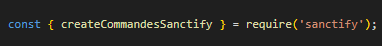
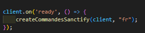
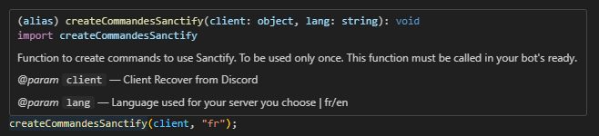

<br>
<div align="center">
  
  <h3 align="center">Sanctify</h3>
  <p align="center">You are currently reading the repository documentation, happy reading :)</p>
</div>
<br>

# Sanctify Repository
Sanctify is a package that allows you to have a warning system for your Discord server via your Discord bot. Easy and quick to use!

<br>

# List of functions:
```
- createCommandesSanctify, 
- engineCommandeSanctify, 
- getDataDatabaseSanctify
```

<br>

# Importants:

### You will obviously need the package of discord.js, better-sqlite3 and quick.db" !

<br>  

You must therefore import the event functions that you need, for example:



<br>

To generate the whole Sanctify process, you need to get the createCommandesSanctify function and call it in your bot's ready :



<br>

Remember to skim over the functions, because you will have the information you need :




#### For engineCommandeSanctify and getDataDatabaseSanctify, you just need to call them in your file, no need in the ready

<br>  

# Support and Feedback
If you encounter any issues or have suggestions for improvement for Sanctify, feel free to create an pull requests !

<br>

# Contact
For any other subject, you can contact me via my email: contact@tsukizo.fr

Warning: please avoid spamming, be rational and understanding 😊.

<br>

# Links

npm : https://www.npmjs.com/package/sanctify?activeTab=readme

Github : https://github.com/xTsuKiZox/sanctify

<br>

### Thank you for using Sanctify !